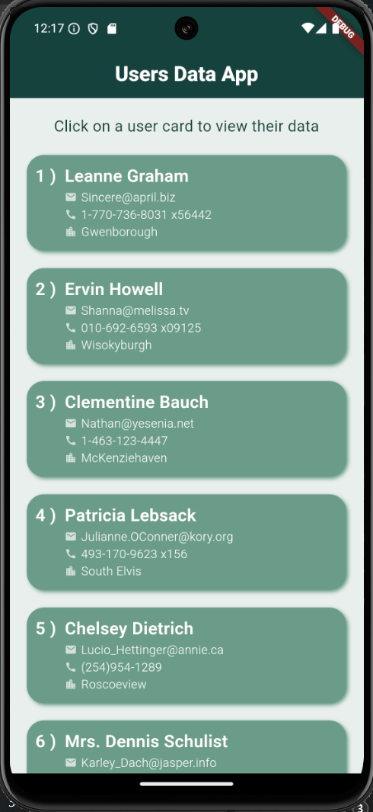
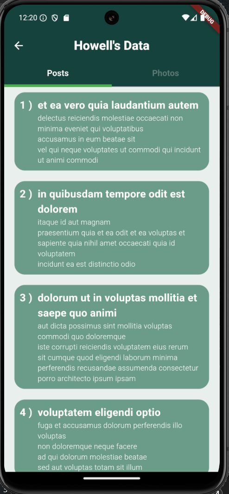
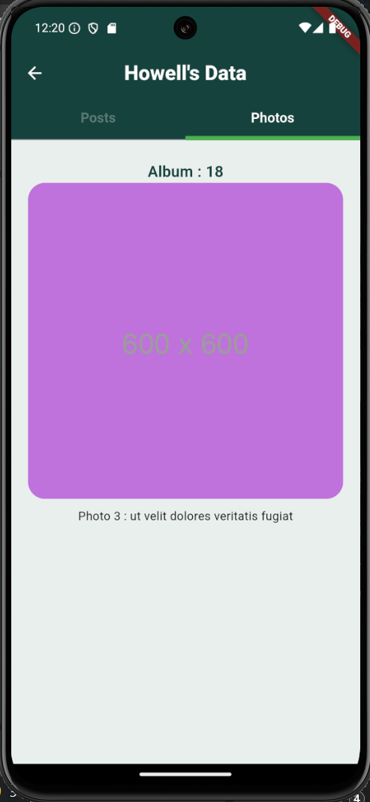

## API Assignment

## Overview 📖
This application reads users data from free API then displays it in an organized manner.

## Main Features ⭐
- Display Users and their data : names, email addresses, phone numbers, etc....
- Display each user's posts
- Display 10 random photos of each user

The posts and photos to be viewed belongs to the user being displayed, meaning that the application can display posts and photos depending on the user chosen.

## Result 🥳

#### All users page

#### Some user posts page

#### Some user photos page

### Video
<video controls src="readme_media/video.mp4" title="Video"></video>