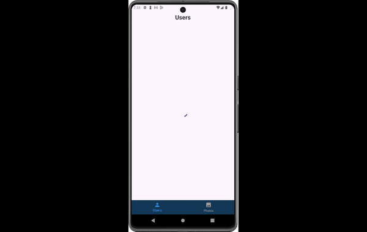

# API App

## Description

This Flutter project is using a jsonplaceholder API to test and practice integration of API into flutter apps. The app displays a list of users fetched, each user has posts and each post has comments. All data are requested by http including photos that can be shown in Photos bottom navigation bar item.

## Features

- Display Users: Fetch and display a list of users.
- View user's posts: Navigate to a list of posts for each user.
- View post's comments: See comments for each post in a bottom sheet.
- View images: Browse through a carousel of random photos.

# Work

## CustomNavigation
- The main navigation widget with a bottom navigation bar.
- Uses NavBloc for managing page navigation state.

## UsersScreen
- Displays a list of users fetched from the API.
- Each user item has a button to view their posts.
- Uses FutureBuilder to handle asynchronous data loading.

## PhotosScreen
- Displays 10 random photos using a carousel widget.
- Fetches photos based on random indices for variety.
- Uses the StackedListCarousel package for the carousel display.
- Optional Parameter {List<int>? photosIndexes}: A list of photo IDs to fetch specific photos. If not provided, all photos are fetched.

## PostsScreen
- Shows all posts of a specific user, based on userId.
- Each post includes a button to view comments.
- Uses PostBloc for state management to handle the display of comments.
- Optional Parameter {int? userId}: Filter posts by this user ID. If not provided, all posts are fetched.

## Helper Files and Packages

### blocs
- NavBloc: Manages the navigation between different screens.
- PostBloc: Handles state changes related to displaying post comments.

### Services
- screen.dart --> for context-related attributes (height and width)
- setup.dart --> for dependency injection using GetIt.

### Custom Widgets
- To organize code and make it easier to read and maintain

### Packages
- flutter_bloc: ^8.1.6
- get_it: ^7.7.0
- http: ^1.2.2
- stacked_list_carousel: ^1.0.1

### Code structure

- ApiConstants: Contains API endpoint constants.
- ApiNetworking: Handles API requests and responses.
- Models: Includes data models for users, posts, comments, photos, albums and todos.
- Screens: Contains UI screens for users, posts, and photos.
- Widgets: Custom widgets to display user information and posts.

## GIF

## Help
If you encounter any issues:
- Make sure you have all the necessary dart files within the project
- Contact us so that we can help resolve the problem

## Authors
Abdulaziz Alamri

## Version History
**See commits history for more details**

## Acknowledgments
Tuwaiq Academy

