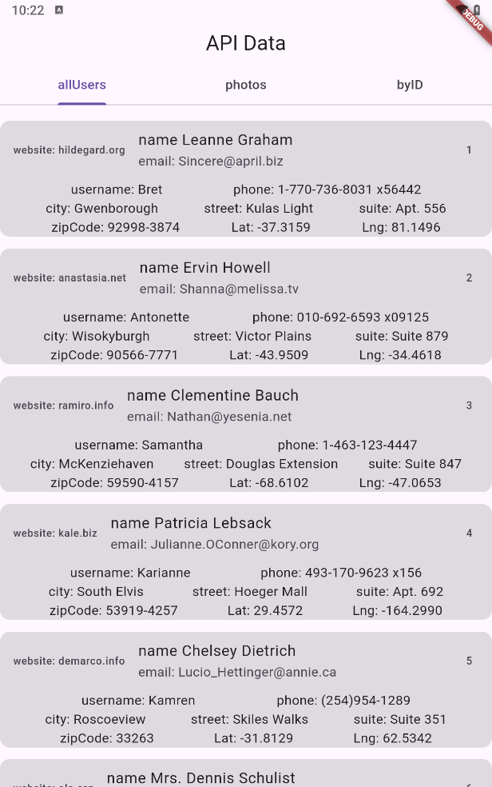
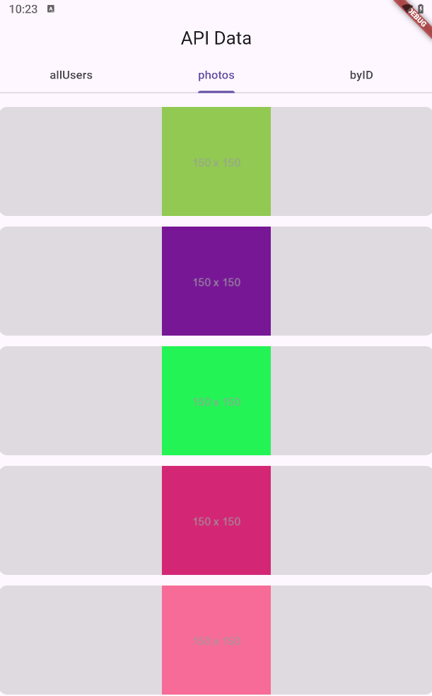
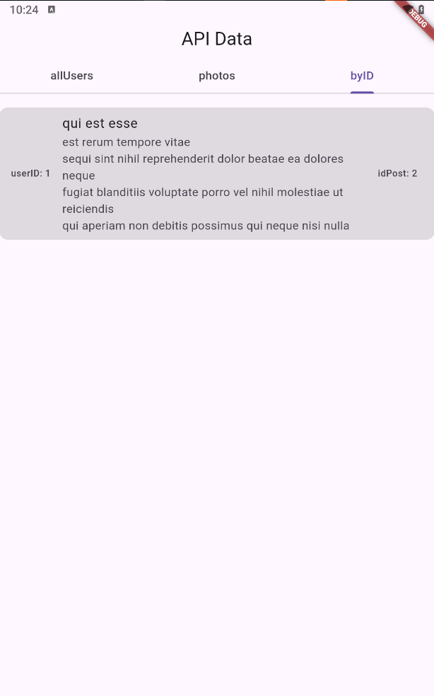
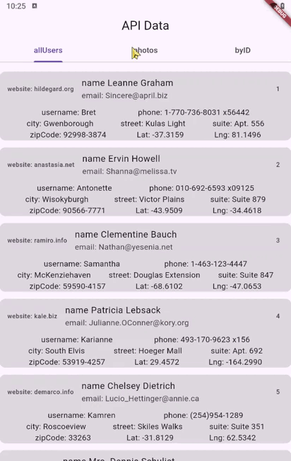

# Flutter Application API

# Overview
Flutter application demonstrates a simple way to interact with a REST API to display data. The app fetches and displays users, photos, and albums from the JSONPlaceholder API.

# Features
Home Screen: 

# Loading State: Displays a CircularProgressIndicator while data is being fetched.
Data State: Renders the UI with the fetched data once available.

# API Integration
API Endpoints
Users: /users - Fetches a list of users.
Photos: /photos - Fetches a list of photos.
Albums: /albums - Fetches a list of albums.

# Data Fetching
allUsers: Fetches and returns a list of users.
photos: Fetches and returns 10 of ten photos.
getPosts: Fetches post to return only those with userId equal to 1.

# Screen

# Vid
