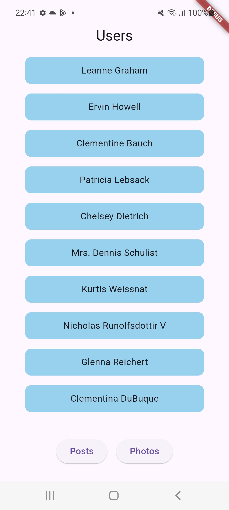
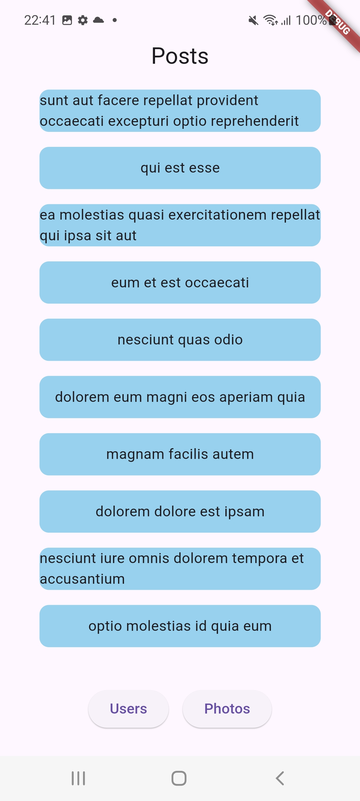
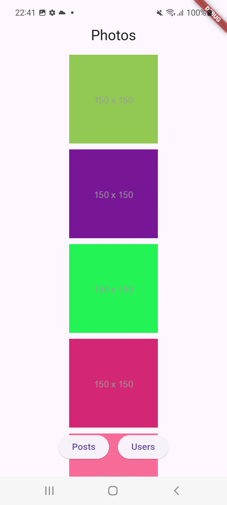

# Flutter API Assignment

This Flutter project fetches and displays data from a free API using the `http` package. The application is organized into three views:
1. **View 1:** Display all users.
2. **View 2:** Display only 10 photos.
3. **View 3:** Display posts where `userId == 1`.

## Features
- **View for Displaying Users:** Shows a list of all users.
- **View for Displaying 10 Photos:** Displays only the first 10 photos fetched from the API.
- **View for Displaying Posts with `userId == 1`:** Shows posts filtered by `userId`.

## Setup Instructions
### Installation

1. **Clone the Repository**

   ```bash
   git clone https://github.com/turki-aloufi/API-assignment.git
   cd API-assignment
   ```

2. **Install Dependencies**

   ```bash
   flutter pub get
   ```

3. **Run the App**

   ```bash
   flutter run

### 2. API Endpoints
- **Users API:** `https://jsonplaceholder.typicode.com/users`
- **Photos API:** `https://jsonplaceholder.typicode.com/photos`
- **Posts API:** `https://jsonplaceholder.typicode.com/posts`


## Screenshots






## Screen recording

<video controls src="assets/Screen_Recording_20240909-225356.mp4" width="300" height="700">
