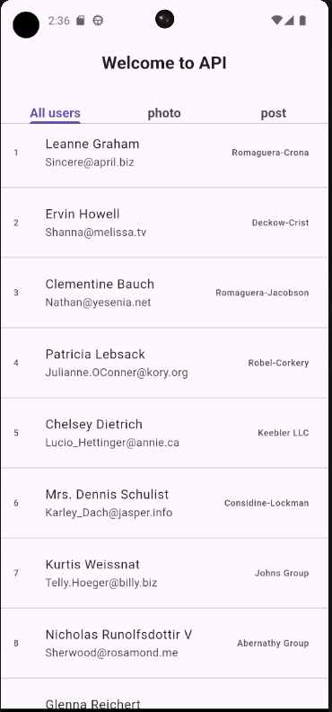
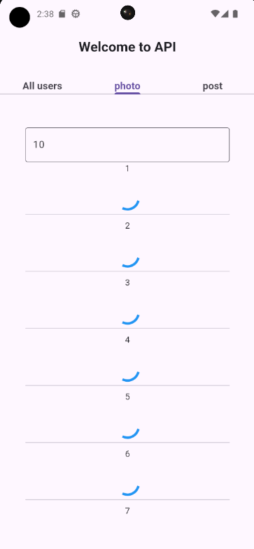
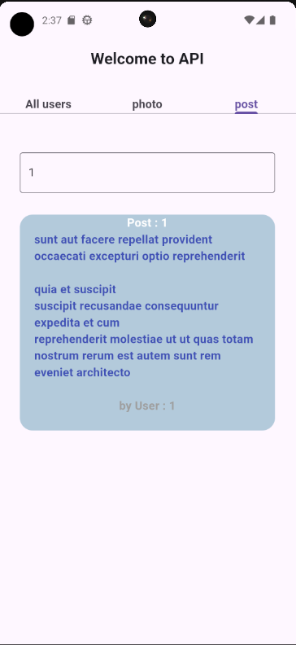

# API Practice project

## Overview

### Purpose
The purpose of this app is to practice on API the api that used in project from [text](https://jsonplaceholder.typicode.com/).

### Features

- **Display all users**: the app display all users from api.
 
- **Display specific quantity of photos**: the app will Display specific quantity of photos based in user choice.
  
- **Display specific post**: The app will Display specific post based on post id.
  
- **State Managment**: The app use BLoC State Managment.

## Widgets & External Packages

### Main Widgets
- **TextField**: The `TextField` widget is used to allow users to input text.

- **ListTile**: The `ListTile` widget is used to display a list of users with an avatar, name, email, and a trailing icon.

### External Packages
- **Cached network image**: A flutter library to show images from the internet and keep them in the cache directory.

- **flutter_bloc**: A predictable state management library that helps implement the BLoC (Business Logic Component) design pattern

## Instructions for Running the App

### Prerequisites
- Flutter SDK

### Running the App
1. Clone the repository: 
   ```bash
   https://github.com/Basel-75/API-assignment.git
2. Navigate to the project directory: 
   ```bash
   cd API-assignment

3. Install dependencies: 
   ```bash
   flutter pub get

4. Run the app on an emulator or connected device: 
   ```bash
   flutter run


## Output

### Screenshot






Fill free to use
