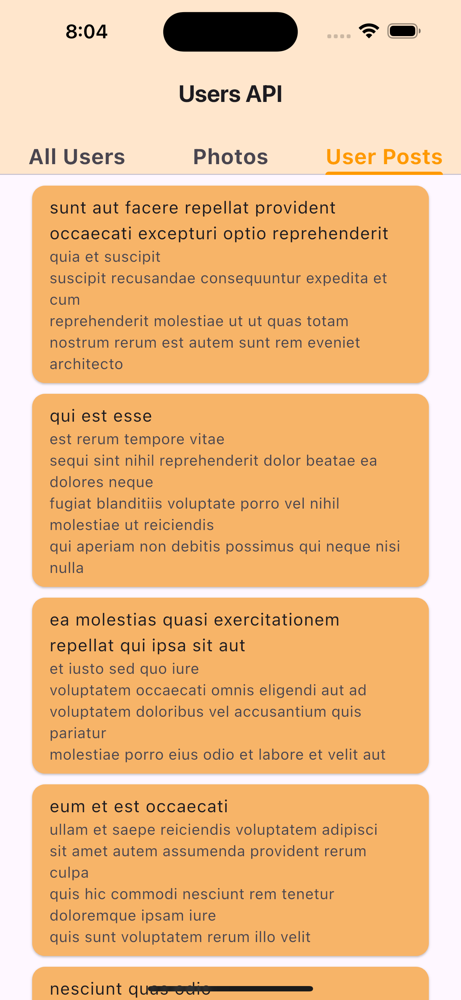

<p align="center">


# API
This API program utilizes data from an external API to render various views:

1. **All Users View**: Displays a comprehensive list of all users retrieved from the external API.
2. **Limited Photos View**: Shows only 10 photos from the external API.
3. **User-Specific Posts View**: Presents posts exclusively for the user with `userId` equal to 1.


## Getting Started

### Prerequisites

- Flutter SDK
- A code editor (such as VS Code or Android Studio)

### Installation

1. Clone the repository:

   ```
   git clone <url>
   ```

2. Navigate to the project directory:

    ```
   cd Project-5/blog_nest.git
   ```

3. Get the dependencies:

    ```
   flutter pub get
   ```
4. open VS Code and Run the app:
    ```
   Code .
   flutter run
   ```

### Packeges 
flutter bloc: Widgets that make it easy to integrate blocs.
```
flutter_bloc: ^8.1.6
```
http:This packege make  consume HTTP resources easier.
```
http: ^1.2.2
```
cached_network_image: provide error handling and caching mechanisms.
```
cached_network_image: ^3.2.3
```

## App Overview
This app provides three distinct views to retrieve and display data from an HTTP API:

1. `All Users View`: This view presents a list of **all users**. When a user is selected, a bottom sheet appears showing detailed information, including the user's `name`, `username`, `ID`, `email`, `phone` number, `address`, and `company` details.
`Limited Photos View`: This view displays **only 10 photos**. If there is an error due to server issues, an error icon will be shown.
`User Posts View`: This view showcases all posts from the **user with ID 1**, including the `title` and `body` of each post.
## OutPut
The outcome:

All users:

<p align="center">


Photos &  UserID `1` Posts:
<p align="center">



GIF of output:
<p align="center">


## Resourses
Packeges: https://pub.dev/

API data: [API](https://jsonplaceholder.typicode.com)

## Language and freameWorkes
- Dart programming language
- Flutter framework

## Created by
**Yara Albouq**
