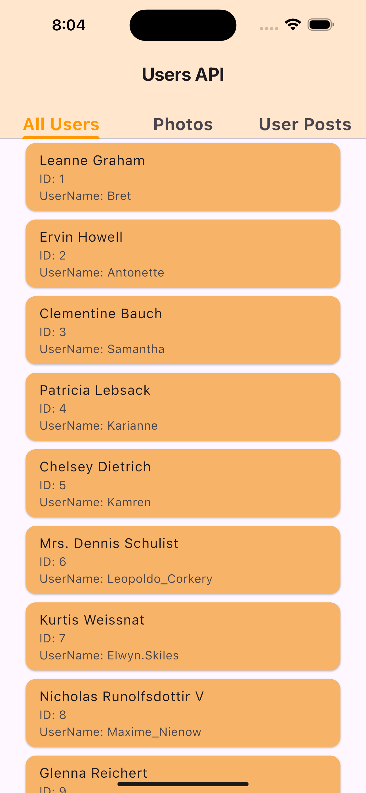
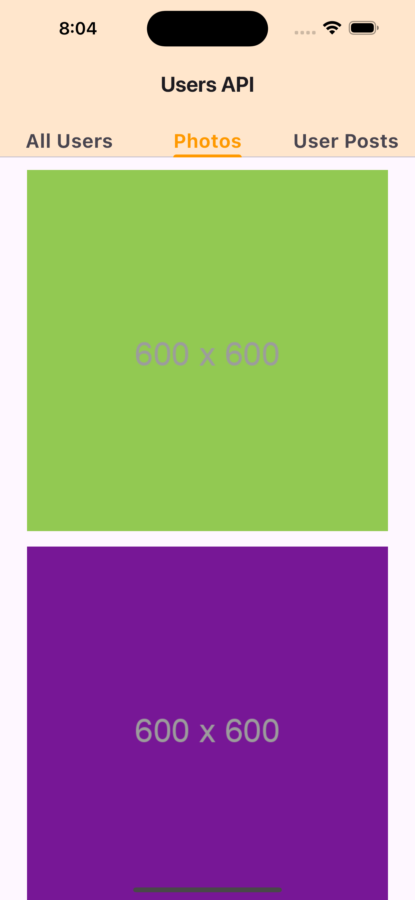

# Flutter Application 

## Overview

This Flutter application demonstrates a simple way to interact with a REST API to display data. The app fetches and displays users, photos, and albums from the JSONPlaceholder API. It features navigation between different screens that showcase various data fetched from the API.

### Features

- **User Screen**: Displays a list of users with detailed information such as ID, name, email, address, phone number, and company details.
- **Photo Screen**: Shows a grid of images fetched from the API with error handling and caching.
- **Album Screen**: Lists albums filtered by `userId` with a gradient text header.
- **Navigation Bar**: Allows users to switch between the User, Photo, and Album screens using a bottom navigation bar.

## Widgets Used

### 1. `Scaffold`

The `Scaffold` widget provides a basic layout structure for the application, including an `AppBar`, `body`, and `bottomNavigationBar`.

### 2. `FutureBuilder`

The `FutureBuilder` widget is used to handle asynchronous data fetching. It builds itself based on the latest snapshot of interaction with a `Future`.

- **Loading State**: Displays a `CircularProgressIndicator` while data is being fetched.
- **Error State**: Shows an error message if data fetching fails.
- **Data State**: Renders the UI with the fetched data once available.

### 3. `CachedNetworkImage`

In the `PhotoScreen`, the `CachedNetworkImage` widget is used to load images from the network with caching capabilities. It displays a placeholder while the image is loading and an error icon if the image fails to load.

### 4. `ShaderMask`

The `ShaderMask` widget is used in the `AlbumScreen` to apply a linear gradient shader to text, creating a visually appealing gradient effect.

### 5. `NavigationBar`

The `NavigationBar` widget provides a bottom navigation bar with icons to switch between different screens of the app.

### 6. `Column` and `Row`

The `Column` and `Row` widgets are used to layout the child widgets vertically and horizontally, respectively.

### 7. `Container`

The `Container` widget is used for styling and adding borders to the UI elements, such as the user details and images.

## API Integration

### API Endpoints

- **Users**: `/users` - Fetches a list of users.
- **Photos**: `/photos` - Fetches a list of photos.
- **Albums**: `/albums` - Fetches a list of albums.

### Data Fetching

- **`getAllUsers`**: Fetches and returns a list of users.
- **`getTenPhotos`**: Fetches and returns a random selection of ten photos.
- **`getAlbumByUserId`**: Fetches albums and filters them to return only those with `userId` equal to 1.

## Screen Shots

### 1 

